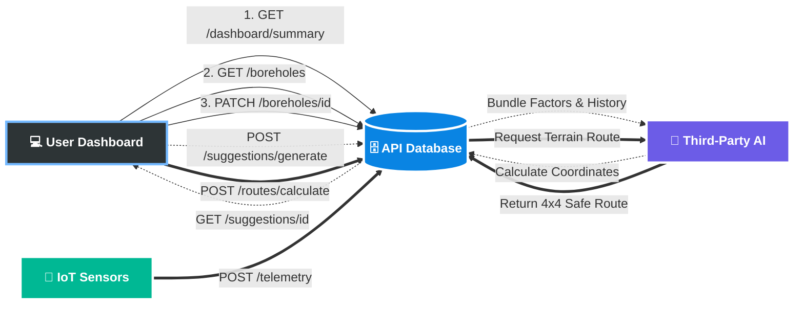

# Equi Well System Flow Diagram

This diagram illustrates the core API architecture. It maps the data flow between the User Dashboard, the API's Light Data Store, automated IoT sensors, and the external AI routing/allocation models.

