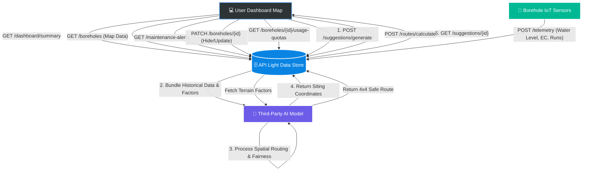

# Equi Well System Flow Diagram

You can use the following flowchart in your presentation to perfectly explain how the system works. It outlines exactly how the Dashboard, the Light Data Store, and the AI Model interact using the API methods we designed.

